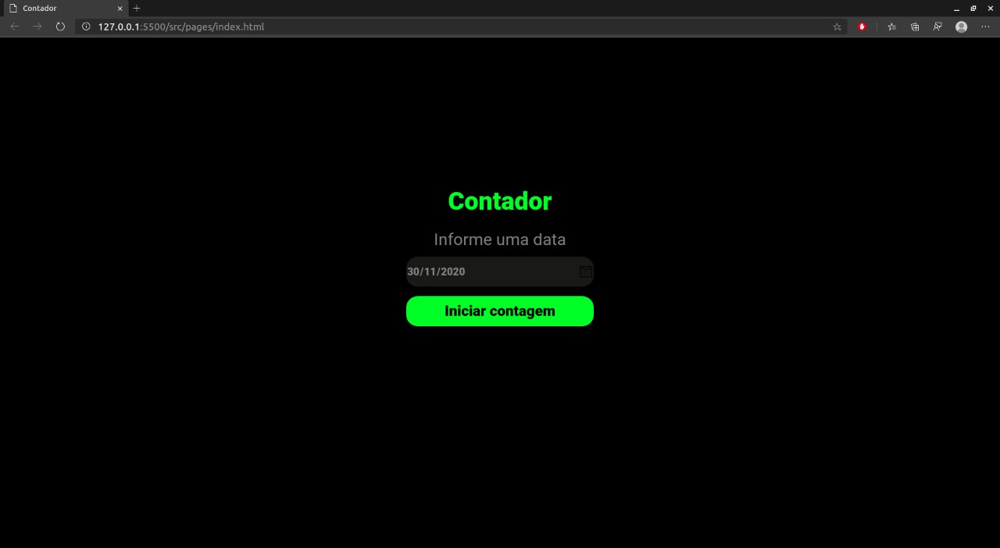
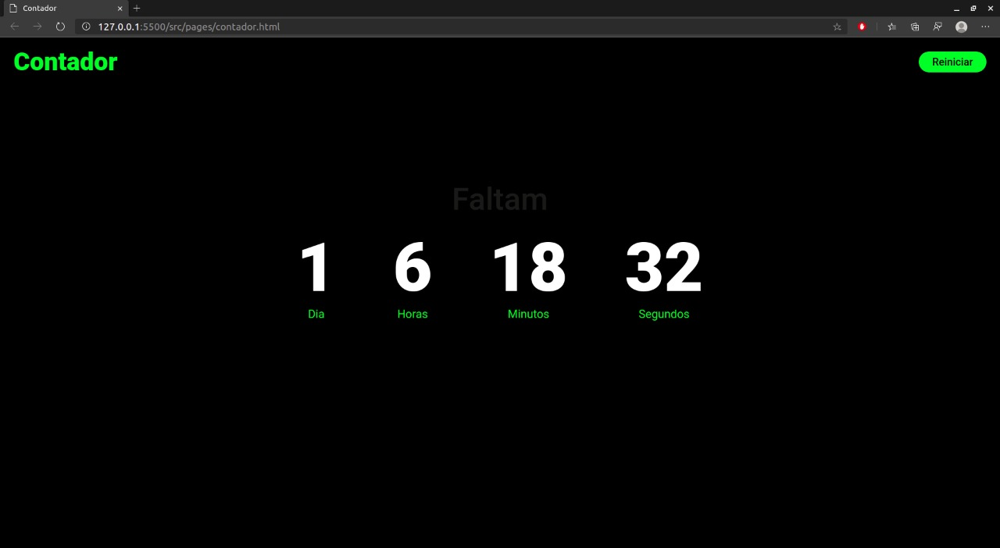

  

  <h3 align="center">Contador</h3>

  

    Aplicação para contar dias, horas, minutos e segundos
        
     
    <a href="https://github.com/Lorenalgm/contador">Desafio</a>
  

## Índice

* [Desafio Devchallenge](#desafio-devchallenge) 
* [Techs](#techs)
* [Início](#início)
* [Contador](#contador)

# Desafio Devchallenge
O desafio proposto pela<a href="https://devchallenge.now.sh/"> DevChallenge</a> é criar um contador com dias, horas, minutos e segundos, a partir de uma data definida. O repositório com as informações do desafio está disponível<a href="https://github.com/Lorenalgm/contador"> aqui</a>.

# Techs
Javascript 
HTML 
CSS 

# Início
28/11/2020, 17:41. 
Definir uma data:

# Contador
Tempo até a data limite:
